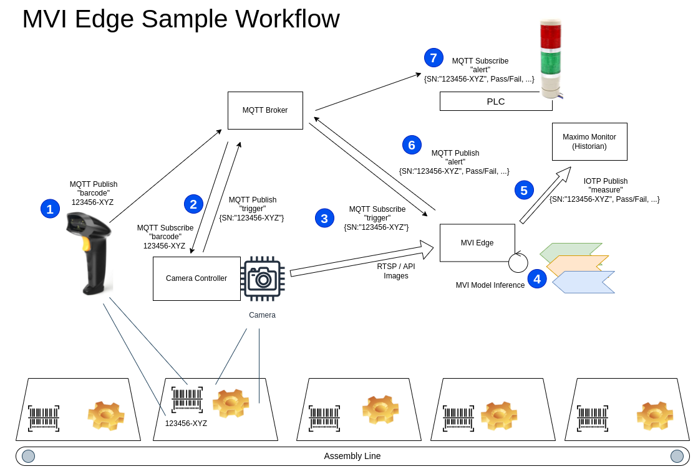

# mvi-edge-camera-controller

This application lets you use a rapberry pi with an attached camera as an input device for Maximo Visual Inspection Edge.
It works by uploading images, as needed, to MVI Edge via a REST API.  It also demonstrates a sample workflow for handling a bar code scanner that initiates an inspection and embeds the scanned data in the inspections.



## Prerequisites

### MVI Edge environment

In MVI Edge, create an *Image Folder* input source.  Name your input source device something like "hq-camera-1"

Create a station and a *Single Shot* triggered inspection using your new input device.  Name your trigger something like "triggers/hq-camera-1"

Put your inspection into *collecting mode*.

### Raspberry Pi 4

A Raspberry Pi 4 running 32bit Raspberry Pi OS (picamera) with an attached camera, like the Pi Camera Module 2 or the Pi HQ Camera.
The Pi needs to be on the same network as the MVI Edge instace.

The following packages need to be installed:
```
sudo apt-get update
sudo apt-get install python3-picamera
sudo apt-get install python3-dotenv
sudo apt-get install python3-paho-mqtt
```

## Installation

Step 1: Grab the code

```
git clone git@github.ibm.com:elowry/mvi-edge-camera-controller.git
cd mvi-edge-camera-controller
```

Step 2: Get a copy of your MVI Edge environment's certificate:

```
sftp <mvi-edge-host>:/opt/ibm/vision-edge/volume/run/var/config/.ssl/visionedgeca.crt .
```

Step 3: Configure the controller for your MVI Edge instance

```
cp sample.env .env
nano .env
```

Step 4: Test the camera configuration

```
./picamera-controller -v --preview
```

If the .env configuration file is correct, the camera will start sending preview images to MVI Edge.  You can view the images in MVI Edge by opening the input source and clicking "Test input source".


Press Ctrl-C to stop sending the preview images.


Step 5: Create some pass / fail rules for your inspection

Alert Type: MQTT

Topic: `alerts/hq-camera-1`

Message:
```
{
  "SN": "{{.trigger.SN}}",
  "Seq": "{{.trigger.Seq}}",
  "Station": "{{.context.Metadata.Station}}",
  "Inspection": "{{.context.Metadata.Inspection}}",
  "Rule": "{{.result.Name}}",
  "InspectionUUID": "{{.context.Metadata.InspectionUUID}}",
  "ImageID": "{{.image.ID}}",
  "ObjectCount":"{{.result.ObjectCount}}",
  "Objects":[
    {{range $j, $obj := .result.FilteredResults}}{{if gt $j 0}},
    {{end}}{
    "Label":"{{$obj.Label.Name}}",
    "Score": {{$obj.Score}},
    "Rect": [ {{$obj.Rectangle.Min.X}}, {{$obj.Rectangle.Min.Y}}, {{$obj.Rectangle.Max.X}}, {{$obj.Rectangle.Max.Y}} ]
    }{{end}}
  ],
  "Result": "{{.result.Result}}"
}
```

Step 6: Enable the inspection via the edge Web UI

Step 7: Start the camera controller

```
./picamera-controller
```

Enter a serial # for the image and press Enter (or just press enter and a number will be generated based on the system time).
